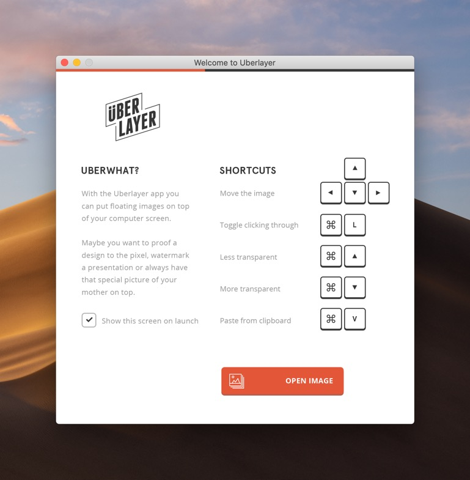
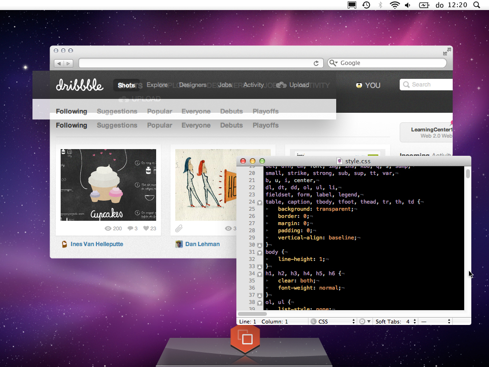
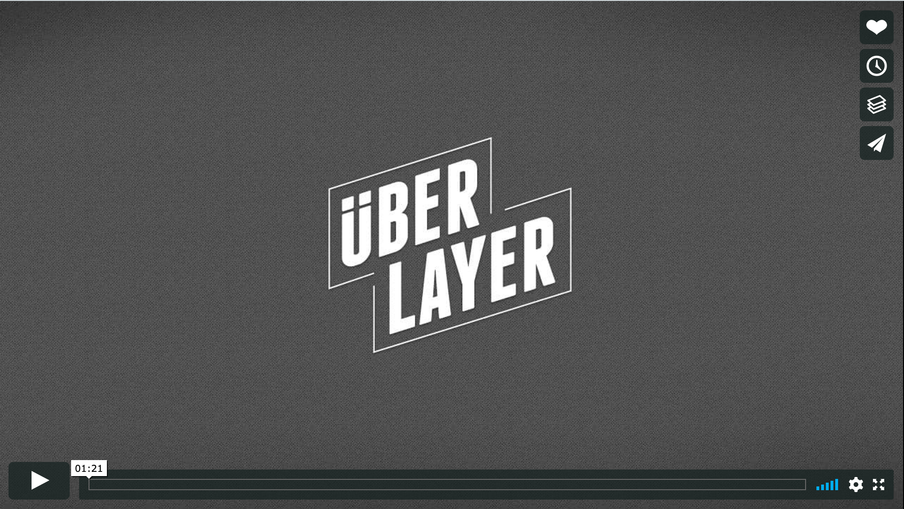

# Uberlayer

Uberlayer was made in 2012 by [Eric-Paul Lecluse](https://github.com/epologee/), [Timo Kuilder](https://timokuilder.com/) and [Jankees van Woezik](https://jankeesvw.com/). We had it on the AppStore, now we decided to open source it here.

## What is Uberlayer

With  the Uberlayer app you can put floating images on top of your computer  screen. Maybe you want to proof a design to the pixel, watermark a  presentation or always have that special picture of your mother on top?

With easy shortcuts:

Position the image with pixel precision using the keyboard  shortcuts, change the transparency so you can see through or lock the  image so it will stay put, exactly where you want it. Locking will also  let you click 'through' the app, so you can work with whatever app you  have running below.

> 
>
> 
>
> 

## Video

